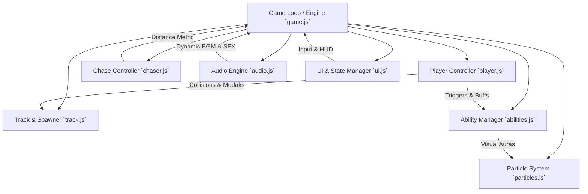

# Implementation Plan: "Ganesh: Modak Run" 3D Endless Runner Game

A complete, polished, playable 3-lane endless-runner 3D game titled **"Ganesh: Modak Run"**. The game is an original Indian devotional and festive game inspired by the endless-runner genre, featuring Lord Ganesha collecting Modaks while playfully running ahead of Goddess Parvati in a joyous temple and festival environment.

---

## User Review Required

> [!IMPORTANT]
> - **Self-Contained Local WebGL (Three.js)**: The game will be built using Three.js with pure Web Audio API synthesis for festival music (sitar/flute/percussion) and sound effects, running directly in any modern browser with 0 external asset failures or copyright risks.
> - **Workspace Location**: The project will be housed in `C:\Users\asus\.gemini\antigravity\scratch\ganesh-modak-run`. We recommend opening or pointing your IDE workspace to this directory.
> - **Respectful Aesthetic**: All character designs, animations, and narrative elements are crafted with deep respect, warmth, family-friendly humor, and cultural fidelity.

---

## Game Architecture & Systems Overview

---

## Proposed Project Structure

All files will be placed in `C:\Users\asus\.gemini\antigravity\scratch\ganesh-modak-run/`:

- **`index.html`**: Main HTML5 container, viewport setup, responsive canvas, festive HUD overlays, main menu, pause modal, shop/customization modal, tutorial dialogues, and game over screen.
- **`css/styles.css`**: Styling with royal saffron, gold trim, temple motifs, floating HUD elements, smooth animations, touch overlay controls, and responsive layouts for desktop & mobile.
- **`js/lib/three.min.js`**: Standalone bundled Three.js library for offline reliability and smooth 60 FPS 3D rendering.
- **`js/audio.js`**: Web Audio API devotional festive sound synthesizer:
  - Procedural Indian instrumental background music (sitar-style plucked harmonics, bamboo flute melodies, rhythmic mridangam/tabla beats).
  - Sound effects: Modak twinkle chime, jump whoosh, slide sweep, shield barrier resonance, vighna-breaker blast, speed dash zoom, ghungroo (ankle bells) chase warnings, gentle closing sitar chord.
- **`js/models.js`**: Procedural 3D model generator:
  - **Lord Ganesha**: Elephant head, graceful ears that flap while running, curved trunk, single tusk detail, magnificent golden mukut (crown), joyful face, pot-bellied silhouette, dhoti with sash, ornaments, articulated limbs for run/jump/slide/eat animations.
  - **Goddess Parvati**: Graceful divine mother figure in vibrant saree with golden borders, tiara, running playfully with golden blessing thali.
  - **Modaks**: Golden pleated sweet dumplings with saffron accents, rotating and bobbing with sparkling halo.
  - **Obstacles**: Carved fallen logs (jump), low festive floral torans/hanging bells (slide), stone temple pillars & brass kalash carts (dodge), water puddle splashes.
  - **Environments**: Sandstone temple pillars, diyas with flame lights, rangoli floor tiles, marigold flower garlands, festival light arches, Kailash mountain background.
- **`js/track.js`**: Procedural modular track generator:
  - 3-lane coordinates (`-2.4m`, `0.0m`, `+2.4m`).
  - Section recycling/object pooling for constant 60 FPS performance without memory garbage spikes.
  - Elevation changes: Slopes, elevated marble bridges, gentle crests, stairs, and dips.
  - 3 seamless biomes:
    1. *World 1*: Traditional Temple Path (sandstone, diyas, bells, rangoli).
    2. *World 2*: Ganesh Festival Street (lights, stalls, marigold banners, torans).
    3. *World 3*: Kailash Mountain Realm (snow peaks, celestial fog, waterfalls, stone flags).
  - Playability verification: Guarantees at least one navigable lane through any obstacle cluster.
- **`js/player.js`**: Player controller:
  - Lane change lerping with snappy responsiveness.
  - Jump arc physics (gravity, jump force, apex hang, smooth landing).
  - Slide/duck mechanics (lowered bounding box, crouch slide animation).
  - Procedural skeletal/hierarchical animation states (Run, Jump, Slide, Stumble, Victory).
- **`js/chaser.js`**: Parvati chase mechanic:
  - Dynamic chase distance (15m–30m nominal; reduces on mistakes, increases on combos/speed).
  - Proximity meter on HUD: "Parvati Distance: 22m" with heart/blessing status.
  - Gentle ghungroo warning when close (<10m).
  - Playful catch cutscene and friendly, non-violent resolution if caught.
- **`js/abilities.js`**: Power-ups & abilities:
  1. **Modak Magnet (Chumbak)**: Pulls nearby modaks smoothly to Ganesha.
  2. **Divine Shield (Kavach)**: Protective golden orb absorbing 1 obstacle hit.
  3. **Vighna-Breaker**: Blasts through obstacles, transforming them into celebratory flower confetti.
  4. **Mushak Speed Boost**: High-speed dash with radial speed lines and 2x score.
  5. **Modak Multiplier**: Doubles/triples modak value during active window.
- **`js/particles.js`**: High-performance particle engine:
  - Golden sparks on Modak collection.
  - Diya flame flickers and incense smoke.
  - Marigold petal bursts on Vighna-Breaker.
  - Speed lines and ground dust puffs.
- **`js/ui.js`**: UI Controller:
  - Main Menu, How To Play / Interactive Tutorial, Abilities Codex, Ganesha Outfits Shop (unlockable with collected Modaks), Settings, High Scores (stored in `localStorage`).
  - Mobile touch swipe detector & optional on-screen virtual d-pad.
  - In-game HUD: Real-time Score, Distance, Modaks, Combo Multiplier, Parvati Distance bar, active ability timers.
  - Game Over & Restart dialog with uplifting festive messaging.
- **`js/game.js`**: Main game coordinator, delta-time loop, camera follow controller with dynamic elevation and shake effects.

---

## Detailed Implementation Steps

### Phase 1: Project Setup & Core 3D Foundations
1. Create directory structure in `C:\Users\asus\.gemini\antigravity\scratch\ganesh-modak-run`.
2. Bundle or fetch lightweight standalone Three.js build.
3. Build HTML shell with viewport, canvas, and Indian festival UI overlay layout.
4. Implement responsive WebGL renderer, scene, dynamic lighting (sunlight, ambient, warm diya point lights), and smooth follow-camera.

### Phase 2: Procedural 3D Models & Animations
1. Sculpt procedural Lord Ganesha 3D model with hierarchical joints (head, trunk, ears, mukut, body, arms, legs).
2. Rig and write procedural animation controllers for running stride, jumping tuck, sliding duck, and eating modaks.
3. Build Goddess Parvati 3D model with graceful running animation and blessing thali.
4. Model authentic golden Modak with ribbed fluting, glowing aura, and idle rotation.
5. Create obstacle models: Fallen temple logs, floral archways, stone pillars, decorative festival carts, and water puddles.
6. Create environmental scenery: Temple pillars, diyas, flower garlands, rangolis, festival street arches, Kailash mountain range.

### Phase 3: Endless Track & World Generation
1. Implement 3-lane modular track system with object pooling.
2. Add elevation variations: Ramps, bridges, gentle hill slopes, stairs, and dynamic camera tilt.
3. Implement 3 seamless world biome shifts (Temple Path -> Festival Street -> Kailash Realm).
4. Implement fair obstacle and Modak cluster spawners (straight lines, zig-zags, jump arcs, lane-transitions).

### Phase 4: Gameplay Mechanics & Controls
1. Player movement: Snappy lane switching (A/D or Left/Right swipe), gravity jump (W/Space/Up swipe), slide duck (S/Down swipe).
2. Collision detection using AABB bounding boxes with custom obstacle tolerances.
3. Modak collection with floating numbers, combo streaks (10x, 25x, 50x) and score multipliers.
4. Goddess Parvati playful chase logic: Distance tracking, obstacle slowdown penalties, speed recovery, and non-violent catch condition.
5. Implement the 5 special abilities with timers, visual effects, and UI activation buttons.

### Phase 5: Web Audio API Festive Sound System
1. Synthesize procedural Indian devotional background music (sitar harmonics, bansuri flute notes, tabla/mridangam rhythms).
2. Create SFX: Modak collect chime, jump whoosh, slide scrape, divine shield clang, ability activation chime, ghungroo bells for Parvati, festive run complete fanfare.
3. Implement mute and volume controls.

### Phase 6: UI, Tutorial, Shop & Polish
1. Festive UI styling with rangoli patterns, golden glow, and responsive typography.
2. Interactive Tutorial explaining lanes, jump, slide, modaks, and abilities.
3. Ganesha Outfits Shop (unlocked by Modaks: Pitambari Yellow, Royal Crimson, Kailash White, Forest Emerald).
4. Local storage for High Scores, Total Modaks, and Settings.
5. Mobile touch support (swipe gestures and on-screen controls).
6. Cross-browser verification and performance profiling.

---

## Verification Plan

### Automated / Headless Verification
1. Start local HTTP server using Python (`python -m http.server 8080`) from project directory.
2. Verify all JS/CSS files load cleanly with status 200 and no syntax errors.
3. Test page load in Chrome/Edge headless or inspect DOM/console logs.

### Manual Gameplay Verification
1. Verify desktop controls: Left/Right (A/D/Arrows), Jump (W/Up/Space), Slide (S/Down).
2. Verify mobile swipe gestures and on-screen touch buttons.
3. Verify Modak collection, combo streaks, and sound effects.
4. Verify all 5 abilities: Magnet, Shield, Vighna-Breaker, Speed Boost, Modak Multiplier.
5. Verify obstacle collisions, jump-over logs, slide-under arches, lane-switch around pillars.
6. Verify Parvati chase distance mechanics and friendly game-over screen.
7. Verify shop outfit unlocks and high-score persistence in localStorage.
